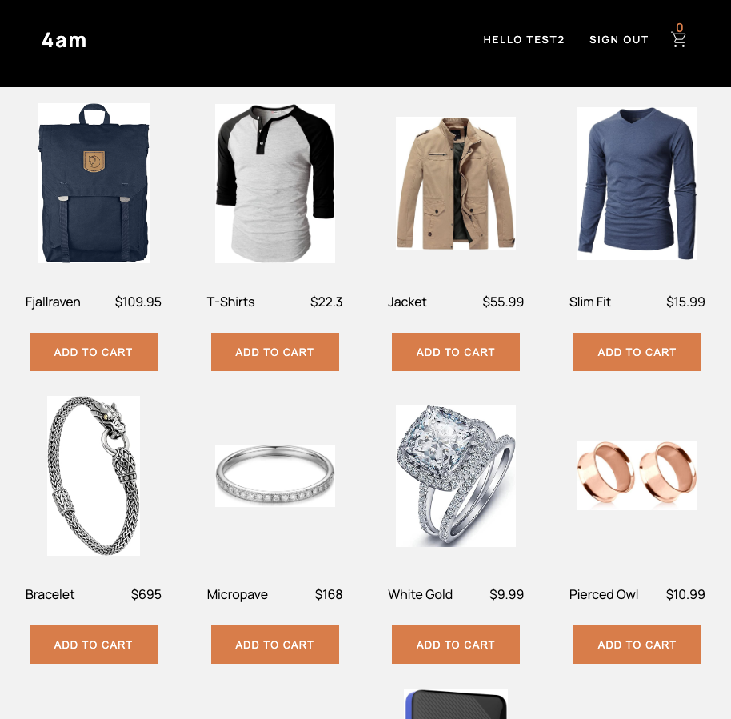
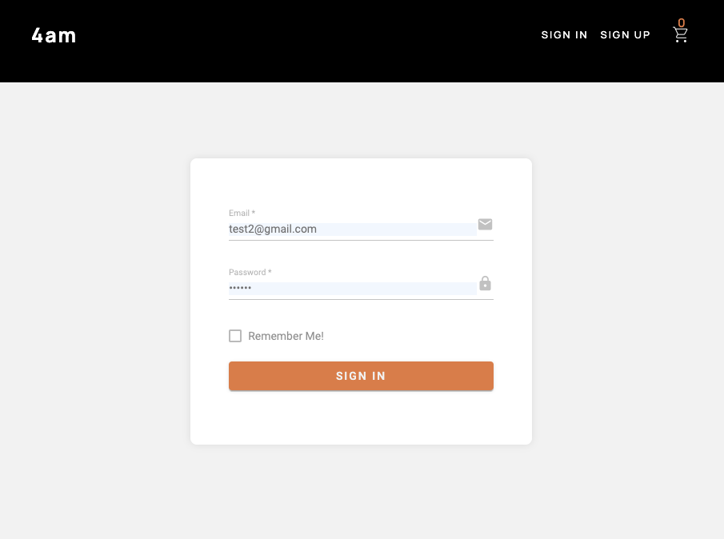
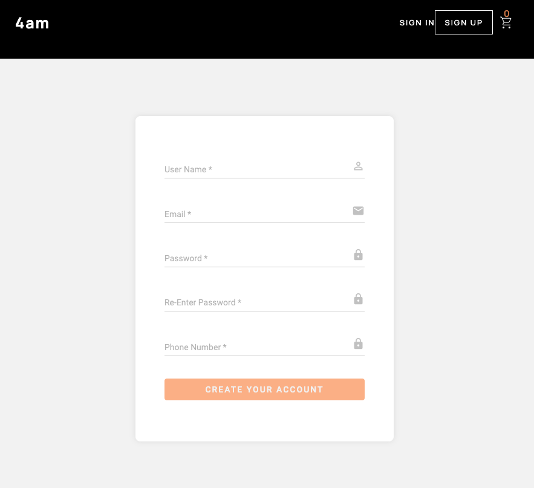
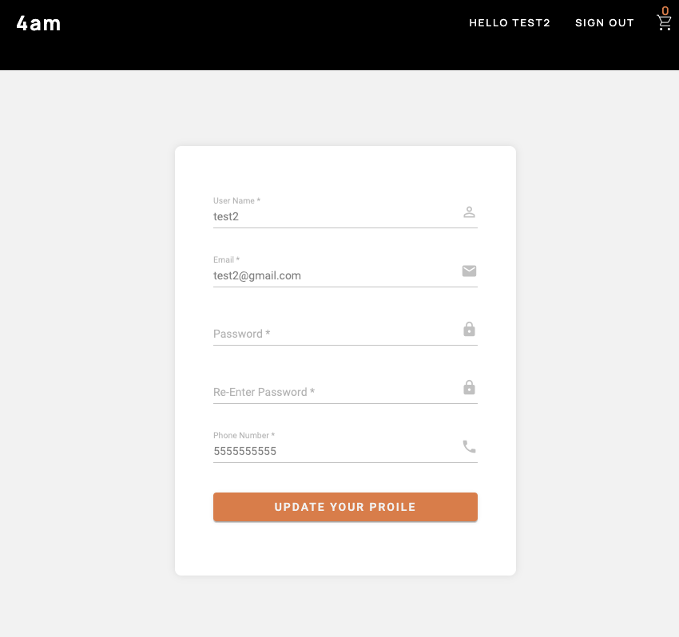
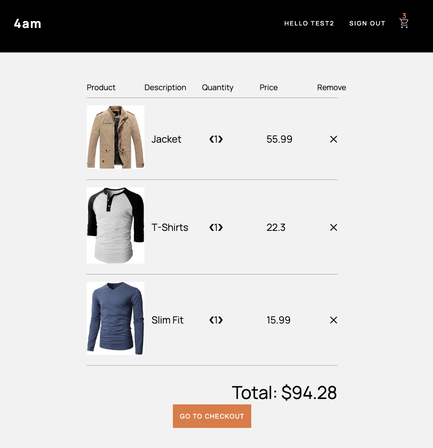
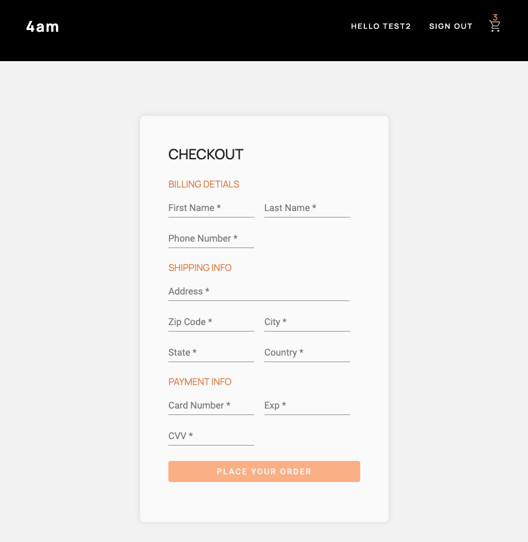
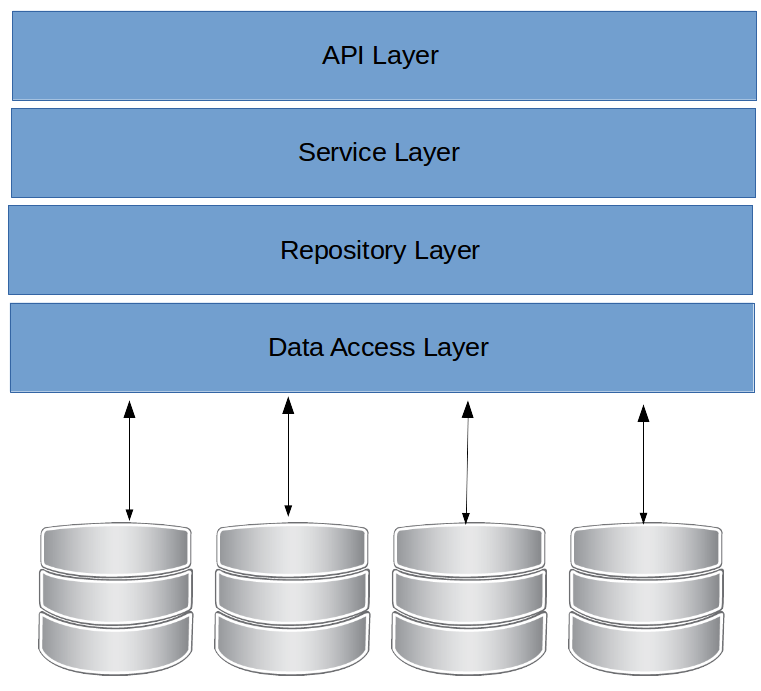
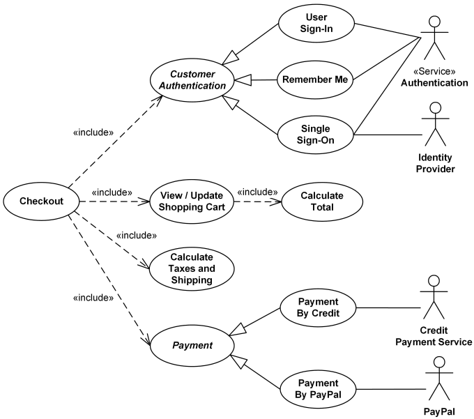

# E-Commerce SPA
- [E-Commerce SPA](#e-commerce-spa)
  - [Summary](#summary)
      - [Strory behind the ***4am***](#strory-behind-the-4am)
  - [Achievements](#achievements)
    - [Front-end:](#front-end)
      - [UI/UX](#uiux)
        - [Homepage](#homepage)
        - [login page](#login-page)
        - [register page](#register-page)
        - [profile page](#profile-page)
        - [cart page](#cart-page)
        - [checkout page](#checkout-page)
    - [Back-end:](#back-end)
      - [Architecture and Entity-Relationship Diagram](#architecture-and-entity-relationship-diagram)
      - [Restful API](#restful-api)
        - [Customer](#customer)
        - [Product](#product)
        - [Order](#order)
        - [Authentication](#authentication)
  - [User Stories](#user-stories)
      - [Guest](#guest)
      - [User:](#user)
    - [Checkout process diagram](#checkout-process-diagram)
    - [Authentication diagram](#authentication-diagram)
      - [Login](#login)
        - [Frond-end](#frond-end)
        - [Backend](#backend)
        - [Back to Frontend](#back-to-frontend)
      - [Logout](#logout)
        - [Frond-end](#frond-end-1)
      - [Register](#register)
        - [Frond-end](#frond-end-2)
        - [Backend](#backend-1)
        - [Back to Frontend](#back-to-frontend-1)
      - [Update Profile](#update-profile)
        - [Frond-end](#frond-end-3)
        - [Backend](#backend-2)
        - [Back to Frontend](#back-to-frontend-2)
      - [Cart](#cart)
        - [Frond-end](#frond-end-4)
      - [Place an order](#place-an-order)
        - [Frond-end](#frond-end-5)
        - [Backend](#backend-3)
        - [Back to Frontend](#back-to-frontend-3)
    - [Funture Goals](#funture-goals)
## Summary
The ***4am***, an online shopping cart app. Makes it possible for customers to select products and buy them online. Consumers to browse, search, and buy products.
A new user can register to the site to become a customer. The login customer could browse the products and add them to the cart, increase or decrease the quantity of the product, or remove the product from the cart.
Then the customer could checkout the products in the cart and pay for them.
* Frontend is built with Angular.
* Backend is built with Spring boot, Spring web, and Hibernate.
* Database is built with PostgreSQL and hosted on AWS RDS.
* Authentication is built with Spring security.
* Hosting is built with Heroku.

#### Strory behind the ***4am***
The developer of this app during the development, got up at ***4am*** very morning and started working on the app, that is why the app is called ***4am***.

## Achievements

### Front-end:
#### UI/UX
##### Homepage

##### login page

##### register page

##### profile page

##### cart page

##### checkout page

* Use Angular to build the front-end of the application.
* User info and cart are stored in the browser's local storage.
* User can keep their session active by logging in.

### Back-end:

#### Architecture and Entity-Relationship Diagram

 
* Customer, Product, and Order data is stored in a relational database.
* All CRUD functionality accessible via RESTful API
* Validate all user input
* Unit test coverage for service-layer classes
* The persistence layer  use Hibernate ORM to translate between the database and the application server. 
* The API layer abstract away the low-level servlets with Spring Web MVC. 
* The server follow a  controller-service-repository architecture.
* The client and server communicate in a RESTful manner.
* The server is stateless. 

#### Restful API
##### Customer
* GET /customers
* POST /customers
* PUT /customers/{id}
* GET /customers/{id}

##### Product
* GET /products
* GET /products/{id}
* GET /products/categories/{category}
* POST /products
* PUT /products/{id}

##### Order
* GET /orders
* GET /orders/{id}

##### Authentication
* POST /Auth/login
* POST /Auth/register

## User Stories

#### Guest
- As a guest, I can register for an account.
- As a guest, I can log in to my account.

#### User:
- As a user, I have a profile which I can view.
- As a user, I can browse products and add them to my cart.
- As a user, I can remove items from my cart.
- As a user, I can checkout to purchase the items in my cart.
- As a User, I should be able to select an amount of an item to add to my cart as I am adding an item
- As a User, I should be able to see and purchase items that are on sale for a lower price.
- As a User, I should be able to see a list of featured products on the main page of the application
- As a User, my session should be maintained until I log out.
- As a User, I should be able to reset my password.

### Checkout process diagram
 

### Authentication diagram
 

#### Login
##### Frond-end
* When customer login, the frontend 'auth.service.ts' will send a json object with username and password to the backend.
##### Backend
* When `AuthController` receive the json object, it will use `AuthService` to check if the user is valid.
* After `AuthService` check if the user is valid, `AuthService` will create a json object with user information and token.
* `AuthController` will send a json object with user information and token to the frontend.
##### Back to Frontend
* After frontend `auth.service.ts` receive the json object with the user infomation and token from the backend, `auth.service.ts` will save the user infomation and token in the local storage.

#### Logout
##### Frond-end
* When customer logout, the frontend 'auth.service.ts' will clear the user infomation and token in the local storage.

#### Register
##### Frond-end
* When customer register, the frontend 'auth.service.ts' will send a json object with username, email, phone to backend.
##### Backend
* When `AuthController` receive the json object, it will use `CustomerSerive` to check if the username and email are unique, if not, it will return an error message.
* if the username and email are unique, `CustomerService` will create a new customer with the username, email and phone.
* `AuthController` will send a json object with the new customer infomation to the frontend.
##### Back to Frontend
* After frontend `auth.service.ts` receive the json object with the new customer infomation from the backend, `auth.service.ts` will redirect to login page to let user login to update the localstorage with the updated user info.

#### Update Profile
##### Frond-end
* When customer update profile, the frontend 'user.service.ts' will send a json object with username, email, phone to backend.
##### Backend
* When `UserController` receive the json object, it will use `UserService` to update the user infomation.
* `UserController` will send a json object with the updated user infomation to the frontend.
##### Back to Frontend
* After frontend `user.service.ts` receive the json object with the updated user infomation from the backend, `user.service.ts` will redirect to login page to let user login to update the localstorage with the updated user info.

#### Cart  
##### Frond-end
* When customer add to cart, the frontend 'cart.service.ts' will update the cart_item in the local storage.
* When customer remove from cart, the frontend 'cart.service.ts' will update the cart_item in the local storage.
* When customer increase the quantity of an item in the cart, the frontend 'cart.service.ts' will update the cart_item in the local storage.
* When customer decrease the quantity of an item in the cart, the frontend 'cart.service.ts' will update the cart_item in the local storage.

#### Place an order
##### Frond-end
* when customer buy a product, `order.service.ts `will create a cart
then customer can add product to cart, then the frontend will create a cart item with product id and quantity
* Before customer checkout, the frontend will never talk to backend.
* All the cart_item(product_id, quantity) will be saved in the frontend local storage.
* when customer checkout, he/she has to provide address and payment information. 
* `cart.service` will get the cart_item(product_id and quantity) from local storage.
* `user.service` will get the user information from the localstorage.
* `order.service`create an json object with customer_id, product_id, quantity, shipping_address and payment_info,use `httpClient` send it to backend.
##### Backend
* When `OrderController` receive the json object, it will use `UserService, AddressSerivice, OrderService` create an order with `customer_id`, `shipping_address` and `payment_info `
* First `OrderService` will create a empty order with order_id and customer_id and pending status 
* Then `OrderDao` will create a `order_item` with order_id, product_id, quantity,subtotal and save it in the database 
* Then `OrderItemDao` will update the total in the order table based on the subtotal of the `order_item` 
* After `PaymentService` verify the payment information, `OrderService` will update the status of the order to paid. 
* `OrderController` will send a json object with order_id, customer_id, shipping_address, payment_info, status, total, order_items to the frontend.
##### Back to Frontend
* After frontend `order.service.ts` receive the json object with the order infomation from the backend, `cart.service.ts` will clear the cart_item in the local storage
* Show the customer order received message
* Redirect to the Home page

  

### Funture Goals
- As a User, I should be able to search the product list to better find the item(s) I am interested in.
- As a User, I should receive notifications when a transaction has occurred or a transfer has been completed.
-  As a User, I should be able to change the color scheme from the normal mode to a dark mode option.
-  As a User, I should be able check the status of my order.
-  As a User, I should be able to view the history of my order.
-  As a User, I should be able to view the list of shipping address.
-  Integrate the payment gateway.for example, paypal, stripe, paytm, etc.
-  Integrate the shipping service.for example, UPS, USPS, Fedex, etc.
-  Add order management system.
-  Add the ability to add a product to the wishlist.
-  Add cutomer management system.
- Sync cart and wishlist with the backend.
- Apply jwt authentication to the frontend.

