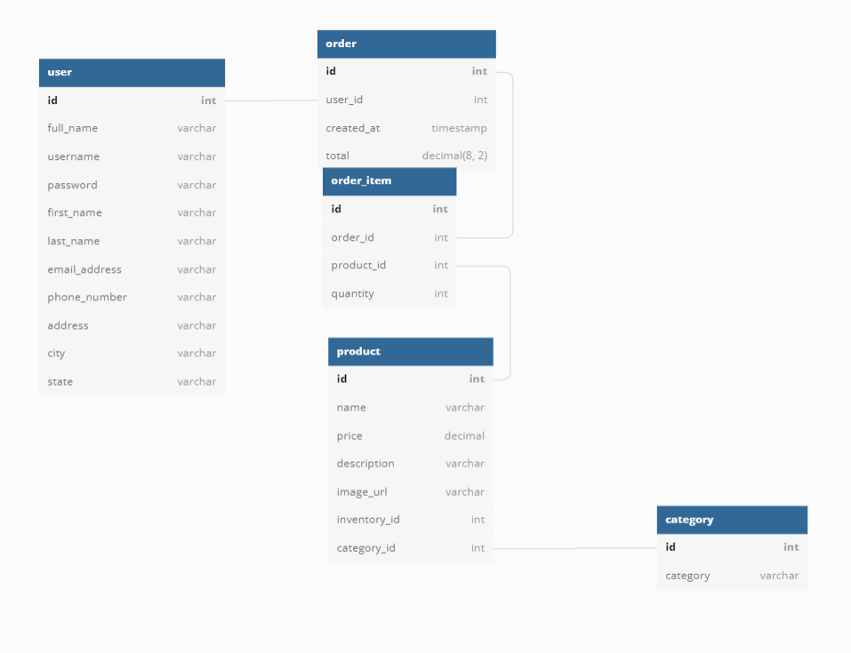
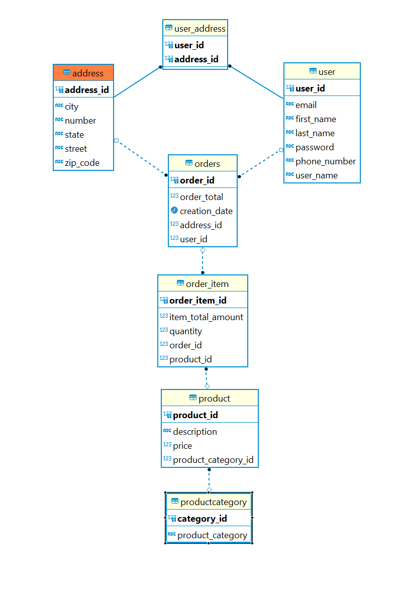

### Pitfalls
#### 1. Inadequate Planning
* No solid database entity relationship diagram
* #### V1(05/05/2022)

#### V2(05/06/2022)

#### TEAM V3(05/09/2022)

#### MINE
 
#### 2. Poor Communication
* Diffrent intepretations of the user story
So our team never agreed on the definition of the cart.
* Is cart a unpaid order?
* Should cartItems persist in memory/front-end browser/database? Or don't persist at all?
* How a about logined user?
* Should users persist in memory/front-end browser/database? Or don't persist at all?
#### 3. Lack of git best practices
##### Good
* FEATURE BRANCHES 
  The advantage of a feature branch separate from master is that you are not breaking anything, you can commit often, merge in the checked-in code of others and push your code to your branch thus keeping it safe and reducing the risk of losing your work.

##### Bad
* NO FEATURE BRANCHES
#### 4. lack of testing
##### six sigmas
* three errors of 1 million.
* it was introduced by American engineer Bill Smith while working at Motorola in 1986
* I as a foreigner, I learned those when i was in college 20 years ago, but when i came to the usa, I find out there are few people knows about it.industrial level.
* american put out standards only for other countries.
* Last but certainly not least, a lack of testing is our last pitfall of software development. Testing is critical to the success of any software project despite the fact that it is often sidelined due to time or budget constraints. Nonetheless, a lack of testing can lead to disastrous results.

#### 5. conclustion
##### The freedom from the Agile is attractive, waterfall is the better fit. 
No one Likes to Follow rules.
Follow, and relax.
Here wants to thank kyle again.

<!-- ## NOTE
Add `hibernate.cfg.xml` to `/backend/src/main/resources`
[A Note About P2](https://github.com/220328-Java-Full-Stack-AWS/Curriculum-Notes/blob/main/P2.md)
 -->

### Basic Design Principles
* build your application code and business logic into your database rather than into the client Web page.
* This will make your application much more portable and will allow your solution to scale upwards
* Customers Table - holds customer information like address, shipping address, billing address, etc.
* Products Table - holds product information like product name, description, size, color, unit price, etc.
* Orders Table - holds information on when an order was placed including Customer ID, date of order, order shipping date, etc.
* Order Details Table - holds information on each product ordered on one order (since typically you can purchase multiple items on the same order) including the product ordered, quantity, unit price, any discounts, etc.

### Naming Conventsions
* pay attention with reserved database keywords.
* use underscore for merged words `first_name`

#### Entities
##### User
##### ShippingAddress

### customer frontend input choice

#### ✅  instead let customer type , only radio or dropdown options are allowed
A much better approach is to limit the choices the customer can make to only those that actually exit. This constraint means that the data entered is always valid. Something that is essential in a big E-commerce app.

### order table
* Since a customer may order multiple items at one time
* the actual product information for each order (quantity, size color, ProductID, etc.) are stored in a separate OrderDetails Table. 
* The two Tables are linked by the OrderID 
* The Orders Table has a One-to-Many Relationship to the OrderDetails Table (one Order can have many OrderDetails)

<!-- #### @Transactional

#### Start Class

?? is this equivalent to SpringBootServletInitializer ?? -->

| id  | email          | password       | phone_number | username |
| --- | -------------- | -------------- | ------------ | -------- |
| 2   | john@gmail.com | 1-570-236-7033 | m38rmF$      | johnd    |

### user story
#### Place a order
when customer buy a product, frontend will create a cart then customer can add product to cart, then the frontend will create a cart item with product id and quantity before customer checkout, the frontend will never talk to backend all the cart_item(product_id, quantity) will be saved in the frontend local storage/session storage/cookie storage

when customer checkout, he/she has to provide address and payment information. * frontend will get the cart_item(product_id and quantity) from local storage/session storage/cookie storage * frontend will create an json object with customer_id, product_id, quantity, shipping_address and payment_info, send it to backend
when backend receive the json object, it will create an order with customer_id, shipping_address and payment_info * first backend will create a empty order with order_id and customer_id and pending status * then backend will create a order_item with order_id, product_id, quantity,subtotal and save it in the database * then backend will update the total in the order table based on the subtotal of the order_item * then after backend verify the payment information, backend will update the status of the order to paid * backend will send a json object with order_id, customer_id, shipping_address, payment_info, status, total, order_items to the frontend
after frontend receive the json object with the order infomation from the backend, it will clear the cart_item in the local storage/session storage/cookie storage * show the customer order received message

#### login
* frontend will use base64 encode email and password and send it to backend 
* backend will check if the email and password match with the database
* if match, backend will send a json object with user_id, email, password(transient), phone_number, username, jwt token to the frontend

